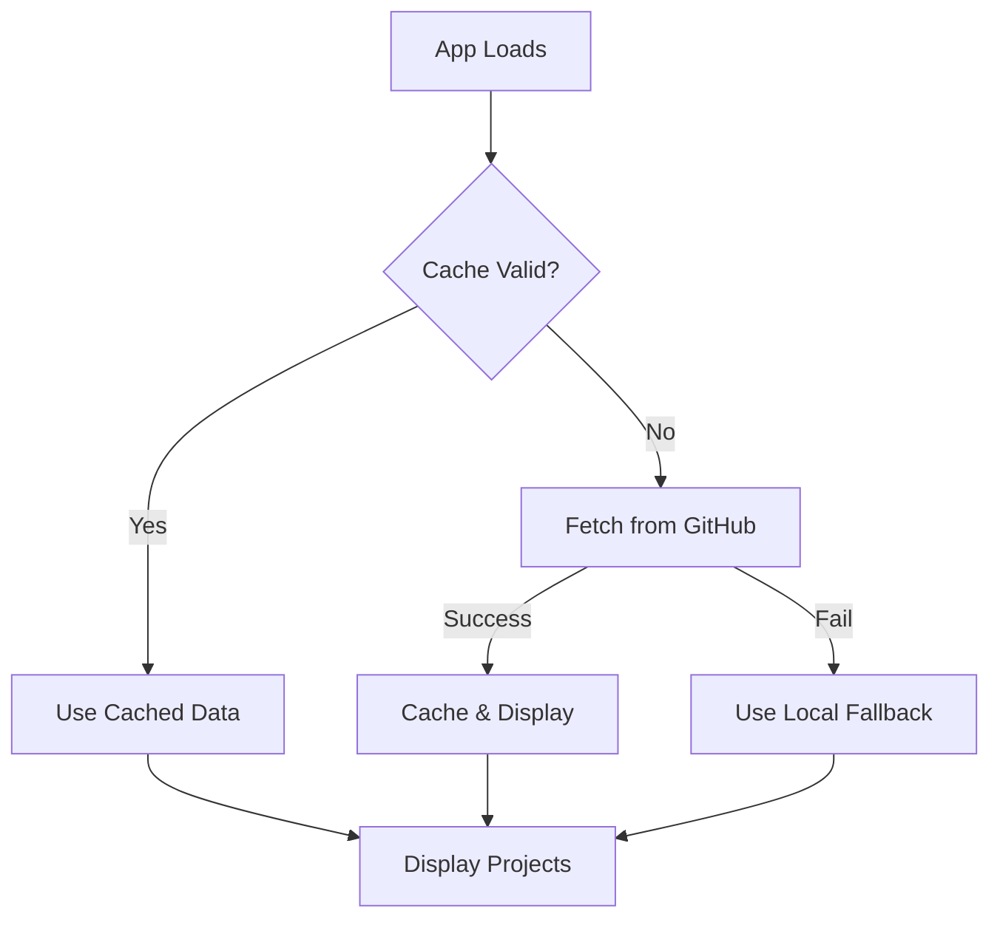

# 📦 Projects Data Management Guide

## 🎯 Overview

The projects data layer uses a **remote-first** architecture that fetches data from a GitHub-hosted JSON file. This allows you to update your project portfolio without redeploying the entire application.

---

## 📋 Quick Reference

### Required Fields (MUST be present):
- `id` - Unique identifier (string)
- `title` - Display title (string)
- `description` - Description text (string)
- `tags` - Array of tag objects with `name` property

### Optional Fields (can be omitted):
- `imageUrl` - Project thumbnail image URL (string)
- `gammaUrl` - Link to external presentation or case study (string)
- `featuredTag` - Badge text displayed on card (string)

---

## 🔄 How It Works



### Data Flow:
1. **Cache Check** - Looks for cached data less than 5 minutes old
2. **Remote Fetch** - Fetches from GitHub if cache is stale/missing
3. **Fallback** - Uses local data if remote fetch fails
4. **Validation** - All data is validated before display

---

## 📝 JSON Structure

### Example `projects.json`:

```json
[
  {
    "id": "new-product-introduction",
    "title": "New Product Introduction Flow",
    "description": "Launching a product shouldn't feel like navigating a minefield. Manual errors weren't just a 'task' problem—they were a 'connection' problem.",
    "tags": [
      { "name": "Time-to-market ↓90%" },
      { "name": "Product Config Months → Days" }
    ],
    "imageUrl": "https://cdn.gamma.app/.../image.png",
    "gammaUrl": "https://hanjing.medium.com/npi-d81cabd403e8",
    "featuredTag": "Enterprise SaaS"
  }
]
```

### Tag Object Structure:
```json
{
  "name": "Your Tag Text"
}
```

---

## ⚠️ Common JSON Errors

### ❌ **Trailing Commas**
```json
{
  "id": "example",
  "title": "Example",  ← ❌ Remove this comma!
}
```

### ✅ **Correct Format**
```json
{
  "id": "example",
  "title": "Example"
}
```

### ❌ **Invalid Tags Array**
```json
"tags": ["Tag 1", "Tag 2"]  ← ❌ Wrong! Tags must be objects
```

### ✅ **Correct Tags**
```json
"tags": [
  { "name": "Tag 1" },
  { "name": "Tag 2" }
]
```

---

## 🚀 Setup Instructions

### 1. Create `projects.json` in Your GitHub Repo

```bash
# In your portfolio26 repository root
touch projects.json
```

### 2. Copy the Example Content

Use the content from `/projects.json.example` as your starting point.

### 3. Get the Raw GitHub URL

Format: `https://raw.githubusercontent.com/USERNAME/REPO/BRANCH/projects.json`

Example: `https://raw.githubusercontent.com/hanjing7/portfolio26/main/projects.json`

### 4. Verify the URL in `/data/projects.ts`

```typescript
const REMOTE_PROJECTS_URL =
  "https://raw.githubusercontent.com/hanjing7/portfolio26/main/projects.json";
```

---

## 🔍 Debugging

### Enable Verbose Logging

In `/data/projects.ts`, change:
```typescript
const DEBUG_VERBOSE = true; // Set to true for detailed logs
```

### Console Messages

✅ **Success:**
```
[projects] Fetching from: https://raw.githubusercontent.com/...
✅ [projects] Loaded 6 projects from remote URL
```

⚠️ **Using Cache:**
```
[projects] Using cached data (6 items)
```

❌ **Validation Error:**
```
⚠️ [projects] Item 0 missing required fields: {...}
```

❌ **Fetch Error:**
```
[projects] Fetch error: SyntaxError: Expected double-quoted property name...
```

---

## 🛠️ Updating Your Projects

### Method 1: Direct GitHub Edit (Recommended)

1. Go to your GitHub repo
2. Navigate to `projects.json`
3. Click "Edit this file" (pencil icon)
4. Make your changes
5. Commit directly to `main` branch
6. Wait ~30 seconds for GitHub CDN to update
7. Hard refresh your site (Ctrl+Shift+R or Cmd+Shift+R)

### Method 2: Git Command Line

```bash
# Edit the file locally
nano projects.json

# Commit and push
git add projects.json
git commit -m "Update projects data"
git push origin main

# Wait ~30 seconds, then hard refresh your site
```

### Method 3: Clear Cache Manually

Open browser console and run:
```javascript
localStorage.removeItem('projects_cache');
localStorage.removeItem('projects_cache_timestamp');
location.reload();
```

---

## 📊 Field Validation Rules

| Field | Type | Required | Validation |
|-------|------|----------|------------|
| `id` | string | ✅ Yes | Must be unique |
| `title` | string | ✅ Yes | - |
| `description` | string | ✅ Yes | - |
| `tags` | array | ✅ Yes | Must be array of `{name: string}` objects |
| `imageUrl` | string | ❌ No | Valid URL if provided |
| `gammaUrl` | string | ❌ No | Valid URL if provided |
| `featuredTag` | string | ❌ No | - |

---

## 🎨 Where Projects Are Displayed

### ProjectCard Component
- Shows project thumbnail with hover overlay
- Displays title, description, and tags
- Featured tag badge in top-right corner
- Rainbow "View Case Study" button on hover

### Used In:
- **PresentationMode** - "Earlier Projects" section
- **Grid Layout** - 3 columns on desktop, responsive

---

## 💡 Tips & Best Practices

### ✅ DO:
- Use meaningful, URL-friendly IDs (e.g., `new-product-introduction`)
- Keep descriptions concise (2-3 sentences max)
- Use high-quality images (recommended: 1200x900px)
- Test your JSON with an online validator before committing
- Keep featured tags short (2-3 words)

### ❌ DON'T:
- Use spaces or special characters in IDs
- Add trailing commas in JSON
- Forget to include the `name` property in tag objects
- Use `http://` URLs (use `https://` for security)
- Exceed 10-12 projects (keep it curated)

---

## 🔧 Advanced: Manual Data Override

If you need to temporarily use different data without changing GitHub:

```typescript
// In App.tsx, replace the fetchProjects() call:
const projectsData = [
  {
    id: "temp-project",
    title: "Temporary Project",
    description: "This is a test",
    tags: [{ name: "Test" }]
  }
];
setProjects(projectsData);
```

---

## 📞 Troubleshooting

### Issue: "Using local fallback data"

**Causes:**
1. GitHub URL is incorrect
2. `projects.json` doesn't exist in your repo
3. JSON syntax errors
4. Network connectivity issues

**Solutions:**
1. Verify the URL in `/data/projects.ts`
2. Check that the file exists on GitHub
3. Validate JSON syntax at jsonlint.com
4. Check browser console for specific errors

### Issue: "Validation failed for X items"

**Causes:**
1. Missing required fields (`id`, `title`, `description`, `tags`)
2. `tags` is not an array
3. Tag objects missing `name` property
4. Wrong data types

**Solutions:**
1. Check console for specific field type mismatches
2. Ensure `tags` is always an array of objects
3. Each tag object must have `{ "name": "..." }`
4. Match the example structure exactly

### Issue: Changes not appearing

**Solutions:**
1. Wait 30-60 seconds after GitHub commit
2. Hard refresh (Ctrl+Shift+R or Cmd+Shift+R)
3. Clear cache manually (see Method 3 above)
4. Check browser Network tab for 304 (cached) responses

---

## 📚 Related Files

- `/data/projects.ts` - Main data loader with validation
- `/data/projects-fallback.ts` - Local backup data
- `/components/ProjectCard.tsx` - Display component
- `/components/PresentationMode.tsx` - Uses projects data
- `/projects.json.example` - Reference template

---

**Last Updated:** January 2026
